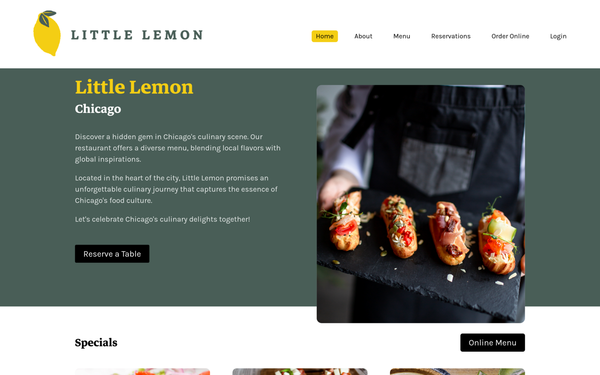
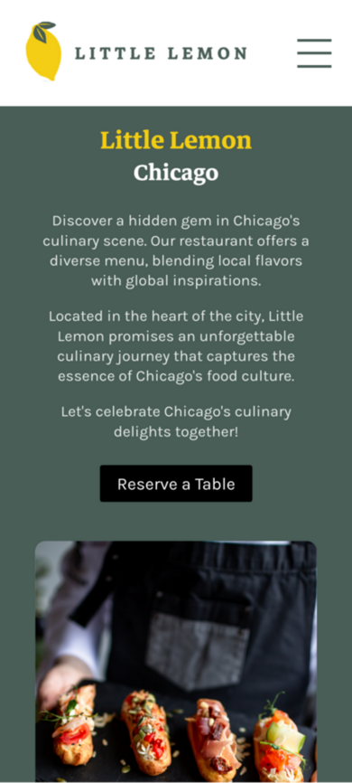

# Meta Frontend Developer Capstone Project

Welcome to the Little Lemon Restaurant website, a project completed as part of Coursera's Meta Front-End Developer course. This web application was designed and built from scratch using React, HTML, and CSS. It showcases various frontend development skills and technologies learned throughout the program.

## Table of Contents

-   [Overview](#overview)
-   [Features](#features)
-   [Screenshots](#screenshots)
-   [Live Demo](#demo)
-   [Installation](#installation)

## Overview

The starting point for this project is a fictional family-owned restaurant located in downtown Chicago. The course's main task consisted in creating a web application featuring a home page, a couple of simple layout pages and an interactive reserve-a-table functionality.

## Features

-   Responsive Design: The website is designed to be a fully responsive SPA, ensuring a seamless user experience on different devices and screen sizes.
-   Semantic HTML: HTML best practices learned during the course were followed to ensure proper document structure and accessibility.
-   React Routing: The project incorporates routing with react-router-dom for seamless navigation between different sections.
-   Table Reservations: A booking system was implemented, allowing customers to reserve tables. I used Formik and Yup libraries for form handling and validation. The form was originally intended to connect to an API for dynamic data, but a mock API was created to replicate this functionality in a static website.
-   Regression Testing: unit tests were added to maintain the integrity of existing features.

## Live Demo

Coming soon...

## Screenshots

## Installation

Follow these steps to run the app locally:

1. Clone the repository or download the zip file from https://github.com/amaliasta/meta-capstone.
2. In the command line, navigate to the project location.
3. Run `npm install` to install dependencies.
4. Run `npm start` to run the app.
5. Open your web browser and go to http://localhost:3000 to see the app running.

